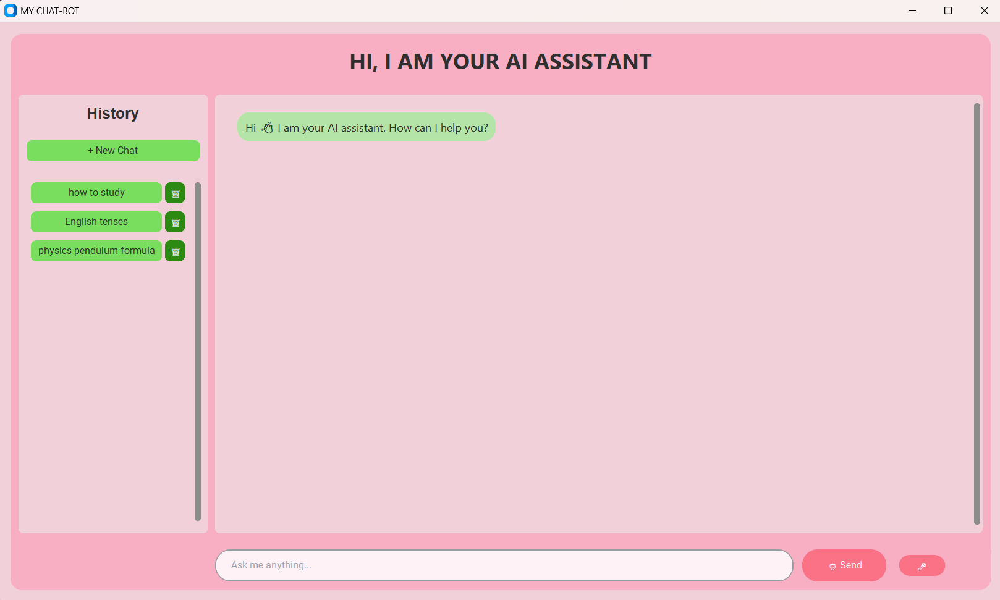
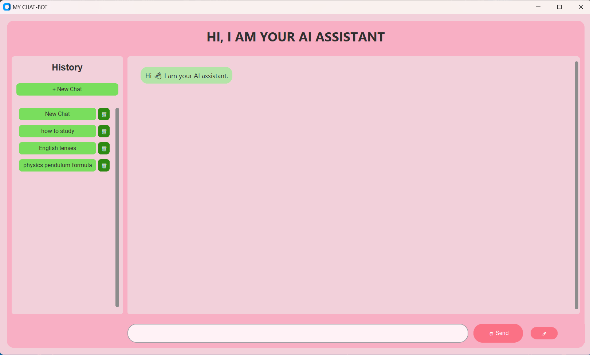
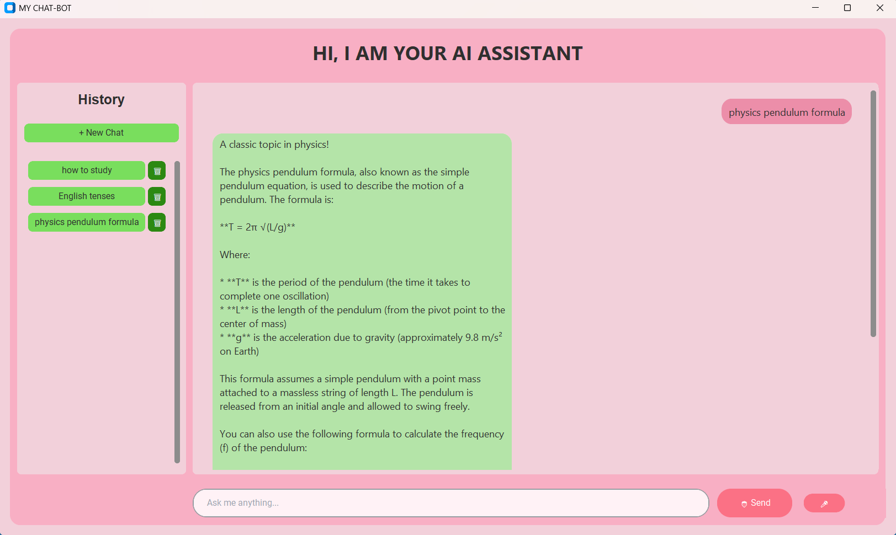
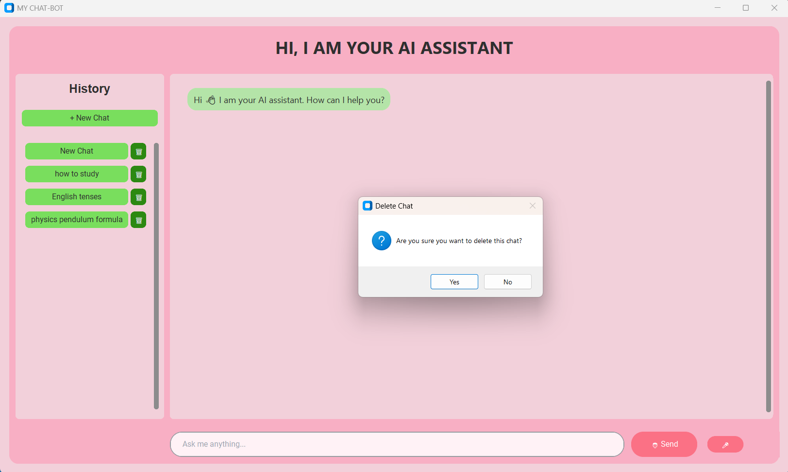

#  AI Chatbot

A modern desktop AI chatbot built with **Python** and **CustomTkinter**, featuring a clean graphical interface, persistent chat history, voice input, and AI-powered conversations using the **Groq Llama API**.

---

##  Features

-  Intelligent AI conversations using the Groq Llama API
-  Modern desktop GUI built with CustomTkinter
-  Multiple chat sessions with conversation history
-  Automatic chat title generation from the first user message
-  Delete individual chat conversations
-  Persistent storage using SQLite
-  Voice-to-text input using Speech Recognition
-  Responsive interface using multithreading
-  Scrollable chat history and message display
-  Clean pastel-themed user interface

---

##  Technologies Used

- Python
- CustomTkinter
- SQLite3
- Groq Llama API
- SpeechRecognition
- Threading
- Tkinter MessageBox

---

##  Project Structure

```
AI-Chatbot/
│
├── gui.py              # Main GUI
├── database.py         # SQLite database functions
├── main.py             # AI API integration
├── chatbot.db          # SQLite database
└── README.md
```

---

##  How It Works

### Text Conversation

1. User types a message.
2. Message is stored in SQLite.
3. First message becomes the chat title.
4. Message is sent to the Groq API.
5. AI response is displayed.
6. Response is saved in the database.

---

### Voice Conversation

1. User clicks the microphone button.
2. Speech is converted to text using Google Speech Recognition.
3. Text is saved in SQLite.
4. If it is the first message, it becomes the chat title.
5. Text is sent to the Groq API.
6. AI response is displayed.
7. Response is stored in the database.

---

##  Voice Recognition

The chatbot supports voice input using the system microphone.

During recording:

-  Microphone turns red
-  Text entry is disabled
-  Send button is disabled

Once recording is complete, the interface automatically returns to its normal state.

---

##  Persistent Chat History

All conversations are permanently stored using SQLite.

Features include:

- Multiple chat sessions
- Chat history
- Automatic chat titles
- Delete chats
- Load previous conversations

---

##  Multithreading

Voice recognition runs in a separate thread to prevent the GUI from freezing while recording or waiting for speech recognition.

---

##  Installation

Clone the repository

```bash
git clone https://github.com/alizka-projects/AI-chatbot.git
```

Move into the project folder

```bash
cd AI-chatbot
```

Run the application

```bash
python gui.py
```

---

##  Screenshots

###  Home Screen


###  New Chat


###  Chats


###  Voice Recording


###  Delete Chat


---

##  Future Improvements

- Dark Mode
- Chat search functionality
- AI image generation
- File upload support
- Chat pinning

---

## 👥 Team

This project was collaboratively developed by members of the **Alizka Projects** GitHub organization.

### Contributors

- **Alishba Khan** – [@Alishba964](https://github.com/Alishba964)
- **Azka Azhar** – [@azka-azhar](https://github.com/azka-azhar)

### Organization

🔗 **Alizka Projects**: https://github.com/alizka-projects


---

## License

This project is developed for educational and learning purposes.